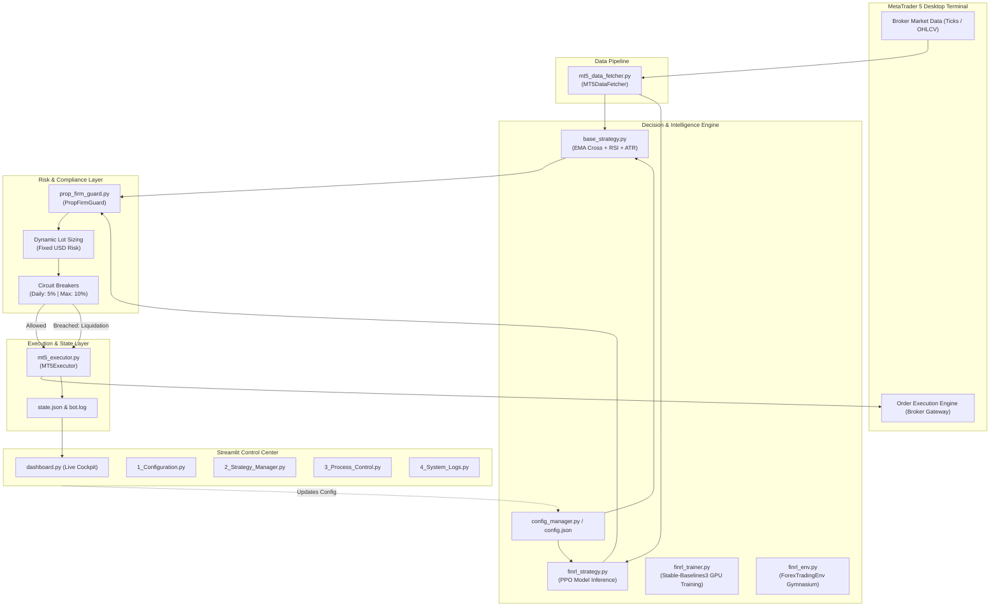
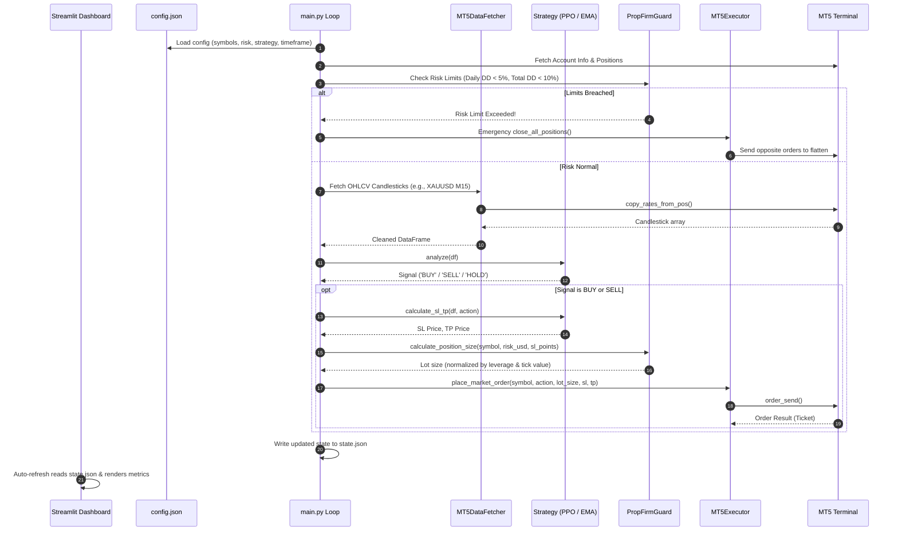

# Prop Firm Quantitative Trading System & MT5 Integration
## Architectural Overview, Core Purpose, and Technical Documentation

---

## 1. Executive Summary & Project Purpose

### 1.1 The Core Problem
Proprietary trading firms (Prop Firms such as FTMO, FundedNext, The Funded Trader, MFF) provide traders access to funded accounts ranging from \$10,000 to \$200,000+ upon passing rigorous evaluations. However, over **90% of algorithmic and manual traders fail these evaluations** due to strict, unforgiving compliance rules:
- **Maximum Daily Loss Limit (typically 5%)**: Breaching 5% equity drawdown calculated from the start-of-day equity balance results in immediate account termination.
- **Maximum Trailing Drawdown (typically 10%)**: Trailing high-water mark or fixed equity drawdown limit.
- **Instrument Leverage Restrictions**: Forex (1:100), Commodities/Metals (1:30), Cryptocurrencies (1:2).
- **Inconsistent Position Sizing**: Failing to dynamically normalize risk across different tick sizes, point values, and asset classes.

### 1.2 The Solution
This workspace hosts the **Prop Firm Quant System** (`PropFirm_System/`), an end-to-end, AI-powered quantitative trading workstation integrated directly with **MetaTrader 5 (MT5)**.

Rather than relying on legacy MQL5 scripts with limited machine learning capabilities and cumbersome debugging, this system decouples the architecture:
- **MetaTrader 5 (Terminal)** is treated strictly as an **execution gateway and live data broker**.
- **Python (Quantitative Engine)** handles data pipelines, Reinforcement Learning (FinRL / Stable-Baselines3 PPO), dynamic position sizing, statistical calculations, backtesting, and strict risk guarding.
- **Streamlit Web Dashboard** provides a modern, low-latency control center for real-time monitoring, live parameter adjustments, strategy switching, and emergency execution.

---

## 2. System Architecture



---

## 3. Directory & Workspace Structure

```
d:/Omnity Era/Antigravity/MQL5/
│
├── Experts/                      # Standard MT5 Expert Advisors (Advisors, Free Robots)
├── Files/                        # MT5 File Sandbox
├── Images/                       # MT5 Graphic Resources
├── Include/                      # Standard MQL5 Include libraries
├── Indicators/                   # Standard & Custom MT5 Technical Indicators
├── Libraries/                    # MT5 DLL/Dynamic Link Libraries
├── Profiles/                     # MT5 Terminal Profiles and Templates
├── Scripts/                      # MT5 One-off scripts
├── Services/                     # MT5 Background Services
├── Shared Projects/              # MetaTrader MQL5 Cloud Projects
├── experts.dat                   # MT5 terminal configuration binary
├── logs/                         # MT5 terminal engine logs
│
└── PropFirm_System/              # 🚀 PRIMARY APPLICATION: Python Quant System
    ├── config.json               # Active dynamic system configuration
    ├── config_manager.py         # Thread-safe JSON configuration loader/writer
    ├── state.json                # Live state snapshot exposed to Dashboard
    ├── bot.log                   # Rolling log file for engine activities
    ├── main.py                   # Main orchestration daemon & loop
    ├── dashboard.py              # Streamlit multi-page dashboard entry point
    ├── requirements.txt          # Python package dependencies
    ├── check_gpu.py              # PyTorch CUDA / GPU diagnostic utility
    │
    ├── backtest/                 # Offline prop firm challenge simulator
    │   └── prop_firm_backtester.py
    │
    ├── data_pipeline/            # Market data ingestion from MT5
    │   └── mt5_data_fetcher.py
    │
    ├── execution/                # Order placement, filling, and emergency liquidation
    │   └── mt5_executor.py
    │
    ├── risk_manager/             # Prop firm compliance rules & position sizing
    │   └── prop_firm_guard.py
    │
    ├── strategy/                 # Algorithmic & Reinforcement Learning models
    │   ├── base_strategy.py      # Technical indicator strategy (EMA/RSI/ATR)
    │   ├── finrl_env.py          # Custom Gymnasium RL environment
    │   ├── finrl_strategy.py     # Real-time PPO model inference engine
    │   ├── finrl_trainer.py      # CUDA-accelerated PPO training script
    │   └── models/               # Serialized PPO neural network weights (.zip)
    │       ├── ppo_EURUSD_m15.zip
    │       └── ppo_XAUUSD_m15.zip
    │
    └── pages/                    # Streamlit control pages
        ├── 1_⚙️_Configuration.py
        ├── 2_🧠_Strategy_Manager.py
        ├── 3_🚀_Process_Control.py
        └── 4_📝_System_Logs.py
```

---

## 4. In-Depth Component Analysis

### 4.1 Risk Manager & Prop Firm Guard ([`PropFirmGuard`](file:///d:/Omnity%20Era/Antigravity/MQL5/PropFirm_System/risk_manager/prop_firm_guard.py))
The `PropFirmGuard` class is the central risk arbiter. No order can reach the broker without passing this component.

#### Key Responsibilities:
1. **Daily Loss Tracking**:
   - Stores `start_of_day_balance` at 00:00 server time.
   - Calculates daily drawdown:
     $$\text{Daily DD} = \frac{\text{start\_of\_day\_balance} - \text{current\_equity}}{\text{start\_of\_day\_balance}}$$
   - If $\text{Daily DD} \ge 5\%$, the circuit breaker activates, cancels pending operations, and triggers position liquidation.
2. **Trailing Max Drawdown Tracking**:
   - Tracks `highest_equity` (high-water mark).
   - Calculates total drawdown:
     $$\text{Total DD} = \frac{\text{initial\_balance} - \text{current\_equity}}{\text{initial\_balance}}$$
   - If $\text{Total DD} \ge 10\%$, trading is permanently halted.
3. **Asset-Class Specific Leverage Constraints**:
   - **Forex**: $1:100$
   - **Metals (Gold/Silver)**: $1:30$
   - **Crypto (BTC, ETH, etc.)**: $1:2$
4. **Normalized Dynamic Position Sizing**:
   - Instead of fixed lot sizes, the bot calculates exact lot volume based on risk per trade in USD ($R_{\text{USD}}$, default \$500):
     $$\text{Loss Per Lot} = \left(\frac{\text{SL Points}}{\text{Trade Tick Size}}\right) \times \text{Trade Tick Value}$$
     $$\text{Lot Size} = \frac{R_{\text{USD}}}{\text{Loss Per Lot}}$$
   - Clamped within broker bounds $[\text{volume\_min}, \text{volume\_max}]$ and aligned to `volume_step`.

---

### 4.2 Data Pipeline ([`MT5DataFetcher`](file:///d:/Omnity%20Era/Antigravity/MQL5/PropFirm_System/data_pipeline/mt5_data_fetcher.py))
- Wraps the native `MetaTrader5` C-extension library.
- Initialises and verifies IPC connection with the running MT5 terminal instance.
- Fetches historical candlestick arrays (`rates`) and parses them into Pandas `DataFrame` indexed by datetime timestamps:
  - Columns: `open`, `high`, `low`, `close`, `tick_volume`, `spread`, `real_volume`.
- Provides instant access to live bid/ask tick snapshots via `mt5.symbol_info_tick(symbol)`.

---

### 4.3 Strategy Engines

#### A. Traditional Quantitative Strategy ([`TrendFollowingStrategy`](file:///d:/Omnity%20Era/Antigravity/MQL5/PropFirm_System/strategy/base_strategy.py))
- **Fast EMA (50)** / **Slow EMA (200)** cross-detection.
- **RSI (14)** filter:
  - Long: Golden Cross with $\text{RSI} < 70$.
  - Short: Death Cross with $\text{RSI} > 30$.
- **Volatility Sizing (ATR 14)**:
  - Stop Loss: $\text{Close} \pm (1.5 \times \text{ATR})$
  - Take Profit: $\text{Close} \mp (3.0 \times \text{ATR})$ ($1:2$ Risk-to-Reward ratio).

#### B. Deep Reinforcement Learning (FinRL & Stable-Baselines3 PPO)
1. **Gymnasium Environment ([`ForexTradingEnv`](file:///d:/Omnity%20Era/Antigravity/MQL5/PropFirm_System/strategy/finrl_env.py))**:
   - **State Space**: Vector of 5 continuous features: `[close, ema_fast, ema_slow, rsi, atr]`.
   - **Action Space**: Discrete(3) $\rightarrow \{0: \text{Hold/Flat}, 1: \text{Buy}, 2: \text{Sell}\}$.
   - **Reward Function with Drawdown Penalty**:
     - Standard reward is proportional to realized trade profit/loss.
     - Shaped with unrealized mark-to-market P&L.
     - **Prop Firm Hard Penalty**: If drawdown exceeds 10%, a catastrophic penalty of $-1000$ is assigned and the episode terminates immediately (`done = True`).
2. **GPU Training Pipeline ([`finrl_trainer.py`](file:///d:/Omnity%20Era/Antigravity/MQL5/PropFirm_System/strategy/finrl_trainer.py))**:
   - Pulls 20,000 to 50,000 historical M15 candles from MT5.
   - Computes features, handles 80/20 train/test split.
   - Trains a Proximal Policy Optimization (PPO) model using `MlpPolicy` over 100,000 timesteps, optimized on local NVIDIA GPUs (e.g. RTX 3050 CUDA).
   - Serializes policy weights into `strategy/models/ppo_<SYMBOL>_m15.zip`.
3. **Live Inference Engine ([`FinRLStrategy`](file:///d:/Omnity%20Era/Antigravity/MQL5/PropFirm_System/strategy/finrl_strategy.py))**:
   - Loads the pre-trained `.zip` model onto CPU for zero-overhead, microsecond inference.
   - Extracts live streaming indicators and outputs real-time action predictions (`BUY`, `SELL`, `HOLD`).

---

### 4.4 Execution Engine ([`MT5Executor`](file:///d:/Omnity%20Era/Antigravity/MQL5/PropFirm_System/execution/mt5_executor.py))
- Checks `PropFirmGuard.check_risk_status()` before dispatching any order.
- Generates `TRADE_ACTION_DEAL` market orders with:
  - `type_filling = ORDER_FILLING_IOC` (Immediate Or Cancel)
  - Magic Number: `234000` (allows distinguishing bot orders from manual trades)
  - Pre-attached SL/TP prices.
- **Emergency Circuit Breaker**:
  - Contains `close_all_positions()`, which iterates over all open positions in the terminal and executes opposite market orders to flatten risk immediately upon limits breach.

---

### 4.5 Prop Firm Backtester ([`PropFirmBacktester`](file:///d:/Omnity%20Era/Antigravity/MQL5/PropFirm_System/backtest/prop_firm_backtester.py))
- Custom vector-simulated backtester built explicitly for prop firm rules.
- Tracks daily balance resets at the boundary of each calendar day.
- Simulates exact SL/TP hit order against candle High/Low bounds.
- Checks whether an evaluation fails or successfully achieves the standard **+8% Profit Target** without breaching the 5% daily or 10% total limits.

---

### 4.6 Streamlit Control Center ([`dashboard.py`](file:///d:/Omnity%20Era/Antigravity/MQL5/PropFirm_System/dashboard.py))
A web-based interface styled with a sleek dark theme:
1. **Cockpit View (`dashboard.py`)**:
   - Live Angular Plotly gauges for Daily Loss % (green $\le 3\%$, orange $3-4.5\%$, red $\ge 4.5\%$) and Trailing DD % (green $\le 6\%$, orange $6-9\%$, red $\ge 9\%$).
   - Account Balance & Equity metric cards with daily return % and open P&L.
   - Live 15M Plotly area chart displaying market price and session metrics (High, Low, Tick Volume).
   - Real-time active positions table showing ticket details, side, volume, and open P&L.
2. **Sub-Pages**:
   - **`1_⚙️_Configuration.py`**: Modify risk USD, daily loss %, trailing DD %, traded symbols, and timeframe with instant `config.json` synchronization.
   - **`2_🧠_Strategy_Manager.py`**: Hot-swap between AI (FinRL) and Static (EMA) strategies, and select available neural network models from `strategy/models/`.
   - **`3_🚀_Process_Control.py`**: Master software switch to start or pause the trading engine.
   - **`4_📝_System_Logs.py`**: Live streaming tail of `bot.log` with one-click log flush.

---

## 5. System Execution Cycle



---

## 6. How to Run the System

### Step 1: MetaTrader 5 Setup
1. Open the **MetaTrader 5** desktop terminal and log into your demo or prop firm challenge account.
2. Navigate to **Tools $\rightarrow$ Options $\rightarrow$ Expert Advisors**.
3. Check **"Allow algorithmic trading"**.
4. In the **Market Watch** panel, ensure your traded instruments (e.g. `XAUUSD`, `EURUSD`, `BTCUSD`) are visible and active.

### Step 2: Environment Verification
Open a PowerShell terminal in your repository root:
```powershell
cd PropFirm_System
python check_gpu.py
```
*Confirms PyTorch CUDA availability for deep learning model training.*

### Step 3: Train an AI Model (Optional)
To train a fresh reinforcement learning policy for a specific symbol:
```powershell
python strategy\finrl_trainer.py
```
*The model will be saved into `strategy/models/ppo_<SYMBOL>_m15.zip`.*

### Step 4: Run Offline Prop Firm Backtest
To verify challenge rules and performance over historical bars:
```powershell
python backtest\prop_firm_backtester.py
```

### Step 5: Start the Live Bot Engine
Run the main daemon in the first terminal:
```powershell
python main.py
```
*The daemon will continuously monitor the market, enforce risk limits, and update `state.json`.*

### Step 6: Launch the Streamlit Monitoring Dashboard
Run the dashboard in a second terminal:
```powershell
python -m streamlit run dashboard.py
```
*Open your browser at `http://localhost:8501` to view the live dashboard and control panel.*

---

## 7. Key Configuration Parameters

All operational settings can be adjusted dynamically via `config.json` or through the **Configuration Page** on the dashboard without restarting `main.py`:

| Parameter | Type | Default | Description |
| :--- | :--- | :--- | :--- |
| `bot_status` | string | `"running"` | Master state (`"running"` or `"stopped"`). |
| `symbols_to_trade` | list | `["XAUUSD"]` | List of instruments to trade. |
| `timeframe` | integer | `15` | Analysis timeframe in minutes (1, 5, 15, 60, 240). |
| `initial_account_balance` | float | `100000.0` | Initial capital for drawdown calculation. |
| `risk_per_trade_usd` | float | `500.0` | Exact dollar amount risked per trade. |
| `strategy` | string | `"FinRLStrategy"` | Active strategy: `"FinRLStrategy"` or `"BaseEMA"`. |
| `model_path` | string | `"strategy/models/ppo_XAUUSD_m15.zip"` | Pre-trained PPO model weights path. |
| `max_daily_loss_pct` | float | `5.0` | Maximum daily equity loss percentage threshold. |
| `max_trailing_dd_pct` | float | `10.0` | Maximum total equity drawdown percentage threshold. |

---

## 8. Summary of Benefits vs. Traditional MQL5 EAs

| Feature | Traditional MQL5 Expert Advisor | This Prop Firm Quant System |
| :--- | :--- | :--- |
| **Logic Environment** | MQL5 (C++ dialect) | Python 3.10+ |
| **Machine Learning** | Very limited (basic ONNX runtime) | Full PyTorch CUDA, FinRL, Gymnasium, SB3 |
| **Risk Control** | Typically static stop losses | Real-time equity high-water mark & daily loss guard |
| **Position Sizing** | Fixed lot or percentage equity | Exact dollar risk normalized by tick size, value, & leverage |
| **Failsafe Liquidation** | Manual script | Automatic multi-order emergency flattener |
| **Monitoring UI** | Standard MT5 chart subwindow | Interactive web dashboard (Streamlit + Plotly) |
| **Hot Configuration** | Requires re-compiling or EA reload | Zero-restart hot-reloading via `config.json` |
